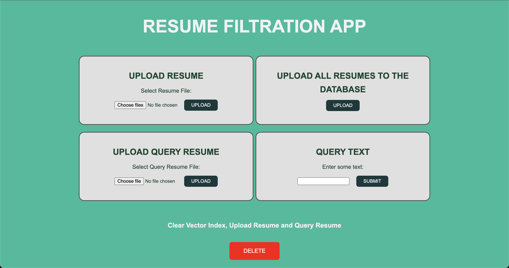
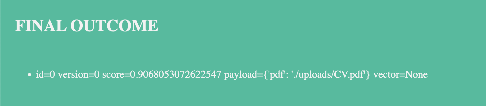

# Qdrant
# Resume Filtration App

###Output

## How to run:

- open two terminals
- In first terminal:
  - cd qdrant
  - docker run -p 6333:6333 qdrant/qdrant

- In second terminal:
  - make the virtualenv: virtualenv -p /usr/bin/python3 env_resume
  - source env_resume/bin/activate
  - cd qdrant
  - python collection.py
  - python -m flask --app app.py run OR python -m flask run
